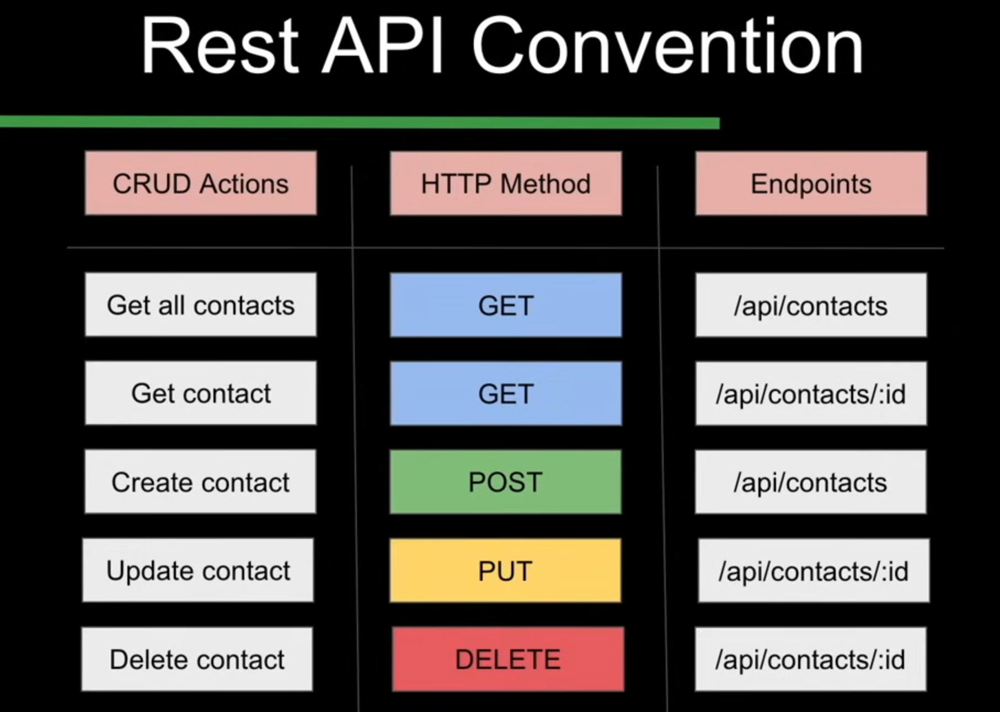

# Contact Management System

API Endpoints:

Commit 1: 'Initial Commit'
- Set 'start' and 'dev' scripts in package.json
- Created server.js
- Used Postman to verify working of api end points 

Commit 2: 'Router'
- Created new directory to configure routes: `router`
- Replaced app.get() with middleware app.use() 

Commit 3: 'Controllers'
- Controllers: contain logic for request respones + connect with database
- Creating API logic methods -> specify labesl : description, route, access specifier
(Access specified: public) - to be made private after implementing auth
- Compress multiple HTTP methods per route (`contactRoutes.js`)

Commit 4: POST Request Body {json} (Via Postman) And Error Handling 
- Request body: required to be parsed using *middleware* - `app.use(express.json());`
- Error Handling: in Controller logic
- Ensuring error message is in json format (currently seen as HTML in Postman): `middleware` directory
    - This is done to ensure Express doesn't return an HTML error page instead of JSON response

Commit 5: Express async handler   
_Promise_: object representing result of an asynchronous operation, such as querying a database. Instead of blocking execution while waiting for a response, Promises allow JavaScript to continue running other code and handle the database response later.
MongoDB operations are asynchronous - don't return results immediately, instead return a Promise which may be resolved (returns data) or rejected (error).
-> Convert all database-related functions: async
- Error Handling async functions -> try-catch block for each function: **Express Async Handler** middleware

Commit 6: Set up MongoDB Shell

Commit 7:    
Created mongoose object (contactModel) -> applying CRUD operations to real database
_await_: pauses JavaScript execution until Promise is resolved
- Implement contactModel in API methods (verify all with Postman)

Commit 8: Authentication  
Specify endpoints for users to register and login  and  Access token provided to manage contacts  
- `userRoutes` and `userController` defined
- `userModel` defined
- Functionality to register/login/current user: logic added to `userController`

Commit 9: JSON Web Token    
Client passes _access token_ to ensure only authenticated users may access private routes
- Defining login endpoint functionality in `userController`
- Can use generated access token to access all private routes 
- Convert `contactController` routes to private, and enforce validation logic
- Creating middleware to validate client token (accessToken is passed in bearer sectin on Postman)

Commit 10: Querying Database  
- Updated `contactModel` with owner user id
- Converting `contactController` routes to private
- using `validateToken` as middleware for all private routes
- Implement `request.user.id` in contactController file to assign contacts to different users

Commit 11:
- Ensuring updating and deleting contacts is only done by owner user - `contactController`